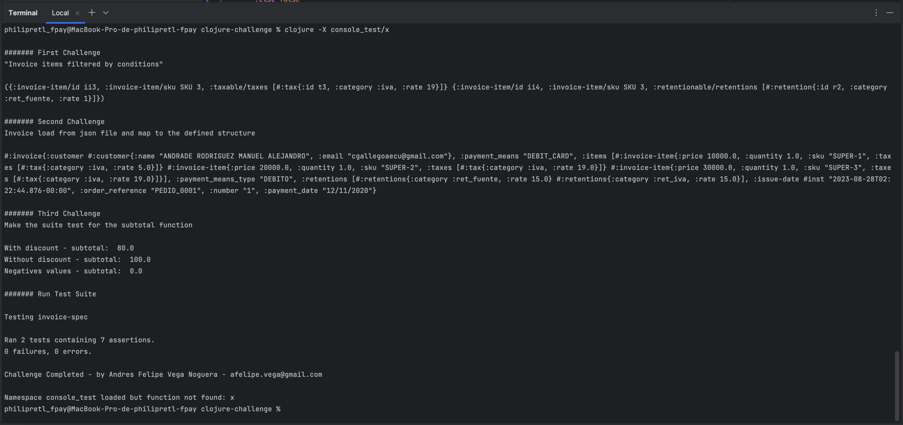

# Engineering Challenge

## Getting started

This clojure challenge is made up of 3 questions that reflect the learning you accumulated for the past week. Complete the following instructions:

1. Create a Github/Gitlab repo to show the challenge code. When complete, send us the link to your challenge results.
2. Duration: About 4-6 hours
3. Install Cursive Plugin to Intellij and setup a clojure deps project. https://cursive-ide.com/userguide/deps.html  

1. Enjoy!

## Problems
### Problem 1 Thread-last Operator ->>
Given the invoice defined in **invoice.edn** in this repo, use the thread-last ->> operator to find all invoice items that satisfy the given conditions. Please write a function that receives an invoice as an argument and returns all items that satisfy the conditions described below.
#### Requirements
- Load invoice to play around with the function like this:

```
(def invoice (clojure.edn/read-string (slurp "invoice.edn")))
```

#### Definitions
- An invoice item is a clojure map { … } which has an :invoice-item/id field. EG.

```
{:invoice-item/id     "ii2"  
  :invoice-item/sku "SKU 2"}
```

- An invoice has two fields :invoice/id (its identifier) and :invoice/items a vector of invoice items

#### Invoice Item Conditions
- At least have one item that has :iva 19%
- At least one item has retention :ret\_fuente 1%
- Every item must satisfy EXACTLY one of the above two conditions. This means that an item cannot have BOTH :iva 19% and retention :ret\_fuente 1%.
## Problem 2: Core Generating Functions
  Given the invoice defined in **invoice.json** found in this repo, generate an invoice that passes the spec **::invoice** defined in **invoice-spec.clj**. Write a function that as an argument receives a file name (a JSON file name in this case) and returns a clojure map such that

```
(s/valid? ::invoice invoice) => true 
```

where invoice represents an invoice constructed from the JSON.
## Problem 3: Test Driven Development
Given the function **subtotal** defined in **invoice-item.clj** in this repo, write at least five tests using clojure core **deftest** that demonstrates its correctness. This subtotal function calculates the subtotal of an invoice-item taking a discount-rate into account. Make sure the tests cover as many edge cases as you can!

# Execution for console 
On the root of the project execute the command 
```bash
clojure -X console_test/x
```




By Andres Felipe Vega Noguera
email: afelipe.vega@gmail.com
phone: +57 3012017499


